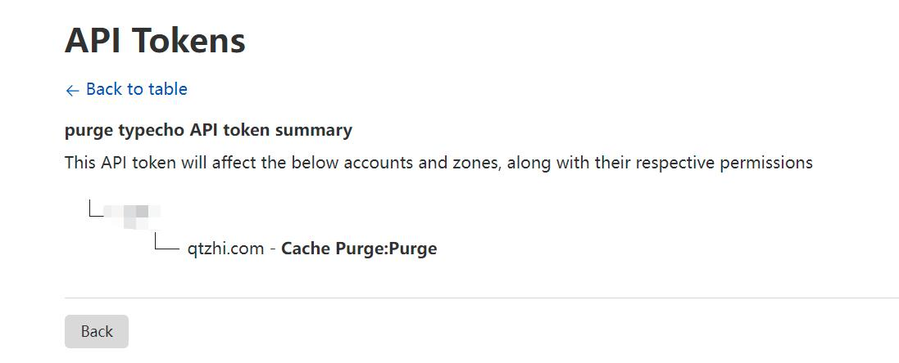

# typecho-plugin-cloudflare-purge-cache

用于清除 Cloudflare 缓存的 Typecho 插件，需要配合 Cloudflare 的 Page Rule 静态化使用。

typecho：下载后将 `CloudflarePurgeCache` 目录放到 Typecho 项目的 `usr/plugins/` 下启用即可。

Cloudflare：在[Cloudflare API 设置页面](https://dash.cloudflare.com/profile/api-tokens)中创建最小权限token即可。 参考token权限设置：

